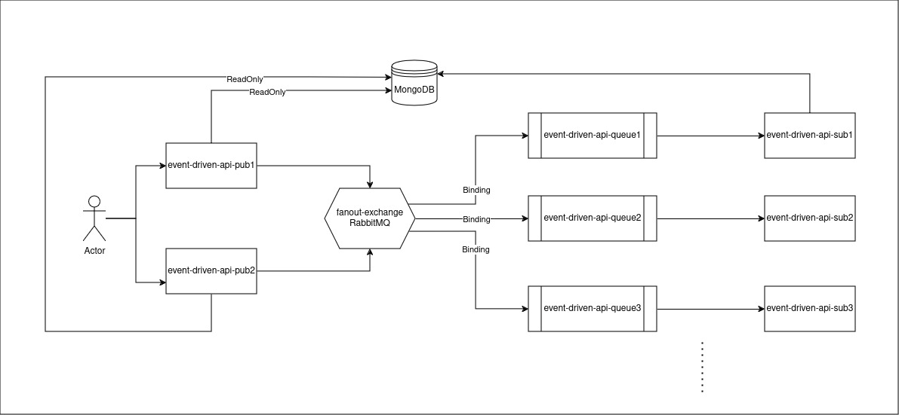

# Sistemas Distribuídos - CARS001 - PPGCA - UTFPR

>Desenvolvam uma aplicação simples orientada a microsserviços. Em cada microsserviço deve ocorrer eventos que sejam de interesse de outros microsserviços. A comunicação entre os microsserviços será orientada a eventos.





Microsserviço event-driven-api-sub2 responsável por consumir mensagens em de uma fila(queue1) RabbitMQ.

### Pré-requisitos

O que será necessário instalar para que o microsserviço funcione corretamente

- Intellij IDEA
- Git
- Java 11
- Gradle
- MongoDB
- RabbitMQ

### Instalação

Passo a passo de execução para que o microsserviço fique em execução e disponível para uso.

- Realizar o clone do projeto:

  Comando: ```git clone git@github.com:saulobergamo/event-driven-api-sub2.git```

- Acessar a pasta do projeto:

    - Executar script para o docker compose:

      Comando: ```docker-compose up```


- Fazer o build do projeto:

  Comando: ```./gradlew build```


- Subir a aplicação local:

  Comando: ```./gradlew bootRun'```

### Qualidade de código

- Executar inspeção com SonarQube:

  Comando: ```./cmds/build-sonar.sh```


- Executar inspeção e correção com Spotless:

  Comando: ```./gradlew spotlessCheck```

  Comando: ```./gradlew spotlessApply```

- Executar inspeção com Detekt:

  Comando: ```./gradlew detekt```
